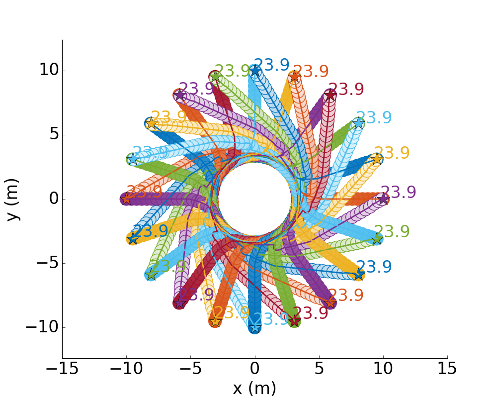

# cadrl_ros (Collision Avoidance with Deep RL)

ROS implementation of a dynamic obstacle avoidance algorithm trained with Deep RL



#### Paper:

M. Everett, Y. Chen, and J. P. How, "Motion Planning Among Dynamic, Decision-Making Agents with Deep Reinforcement Learning", submitted to IEEE/RSJ International Conference on Intelligent Robots and Systems (IROS), 2018
Link: to be added

#### Dependencies:

* [TensorFlow](https://www.tensorflow.org/) is required (tested with version 1.4.0)

* [ROS](http://wiki.ros.org/) is required (tested with Kinetic on Ubuntu 16.04)

* numpy

#### Notes:
The main contribution of this software is the `network.py` file and trained model parameters (TensorFlow checkpoints).
Those contain the policy as reported in our paper and enables other reasearchers to easily compare future algorithms.

As an added bonus, we provide a ROS implementation that we tested on a Clearpath Jackal ground robot.
This node is just one module of the software required for autonomous navigation among dynamic obstacles, and much of it is written as to integrate with our system.
The ROS node as written may not be particularly useful for other systems, but should provide an example of how one might connect the modules to test our learned collision avoidance policy on hardware.
For example, other systems likely have different representation formats for dynamic obstacles as extracted from their perception system, but it should be straightforward to just replace our `cbClusters` method with another one, as long as the same information makes it into the state vector when the policy is queried.

The algorithm was trained with goals set to be <10m from the agent's start position, so it would be necessary to provide this system with local subgoals if it were to be tested in a long journey.
For short distances, say in an open atrium, this is probably not necessary.

#### To Run:
Clone and build this repo (assume destination is ~/catkin_ws/src)
```
$ cd ~/catkin_ws/src
$ git clone git@github.com/mfe7/cadrl_ros
$ cd ~/catkin_ws && catkin_make
```

Connect inputs/outputs of your system to `launch/cadrl_node.launch`

##### Subscribed Topics:
* ~pose [[geometry_msgs/PoseStamped]](http://docs.ros.org/api/geometry_msgs/html/msg/PoseStamped.html)
	Robot's pose in the global frame

* ~velocity [[geometry_msgs/Vector3]](http://docs.ros.org/kinetic/api/geometry_msgs/html/msg/Vector3.html)
	Robot's linear velocity in the global frame (vx, vy)

* ~goal [[geometry_msgs/PoseStamped]](http://docs.ros.org/api/geometry_msgs/html/msg/PoseStamped.html)
	Robot's goal position in the global frame

* ~clusters [[ford_msgs/Clusters]]()
	Positions, velocities, sizes of other agents in vicinity

* TODO: planner_mode, safe_actions, peds

##### Published Topics:
* ~nn_cmd_vel [[geometry_msgs/Twist]](http://docs.ros.org/api/geometry_msgs/html/msg/Twist.html)
	Robot's commanded twist (linear, angular speed) according to network's output

* The other published topics are just markers for visualization
	* ~pose_marker shows yellow rectangle at position according to ~pose
	* ~path_marker shows red trajectory according to history of ~pose
	* ~goal_path_marker shows blue arrow pointing toward position of commanded velocity 1 second into future
	* ~agent_markers shows orange cylinders at the positions/sizes of nearby agents

* TODO: remove other_agents_marker, other_vels

##### Parameters:
* ~jackal_speed
	Robot's preferred speed (m/s) - tested below 1.2m/s (and trained to be optimized near this speed)

#### Primary code maintainer:
Michael Everett (https://github.com/mfe7)
